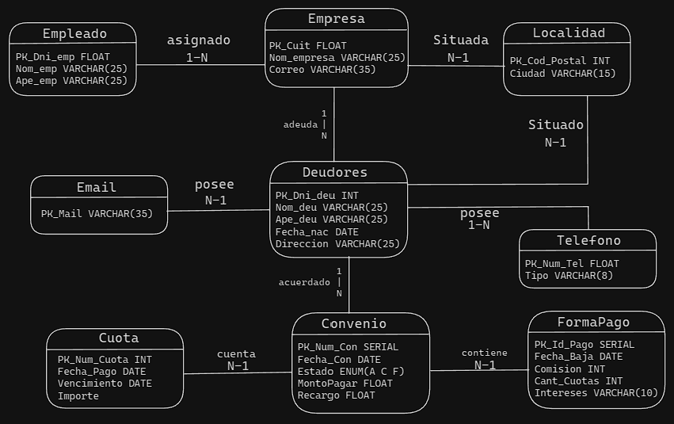

# Proyecto: CobroYA SRL

**Descripción:**

Proyecto de trabajo final de materia de base de datos. Consistió en la consulta e investigación sobre el caso para determinar los requerimientos que debe solventar la base de datos y entendimiento del modelo de negocio, teniendo en cuanta el control sobre las operaciones realizadas por los usuarios sobre la base de datos. Y la realización de diferentes consultas solicitadas para la realización de diferentes informes.

**Escenario:**

Cobro Ya cuenta con varios clientes, empresas que eligen a Cobro Ya para que cobren las deudas generadas por sus propios clientes, a los cuales no les pueden cobrar ellos mismo.

De dichas empresas se necesita saber: el nombre, CUIT, correo electrónico y localidad. Las empresas que contratan a Cobro Ya, pasan una cartera de clientes, la misma cuenta con información del cliente deudor: nombre, DNI, fecha de nacimiento, localidad de residencia y dirección, así como información de contacto de dicho cliente: mail, tipo y número de teléfono, donde cada uno do estos datos pueden ser más de uno por cliente, y por supuesto el monto total adeudado.

La dinámica de Cobro Ya es, designar a un empleado, una o más empresas a gestionar, el empleado, del cual se tiene el nombre y DNI, se comunicará con los clientes deudores, ofreciéndoles una forma de pago de la deuda.

Las formas de pago, son todas las opciones posibles que tiene el cliente deudor para pagar su deuda, es importante aclarar, que dichas formas de pago son las mismas para todos los clientes, no importa de qué empresa sean. Las formas de pago, las decide Cobro Ya. Cada forma de pago, está compuesta por: cantidad de cuotas, interés a aplicar, fecha de baja, que, en caso de ser cargada, indicará que el plan de pago está dado de baja y no podrá ofrecerse, y un porcentaje de comisión, que es el que Cobro Ya cobrará por cada cuota cobrada.

El objetivo del empleado es que el cliente haga un Convenio, en el cual figure: el cliente, la forma de pago que eligió el empleado que lo atendió, la fecha de generación del convenio y un número de convenio que irá creciendo uno a uno en base a la cantidad de convenios firmados.

El convenio, contará con tantas cuotas como figure en el plan de pago elegido, las cuotas deberán tener la siguiente información: número de cuota, vencimiento de la misma, importe de la cuota, algo que determine si la cuota está pagada o no y una fecha de pago.

A fines prácticos se acordó que un deudor no puede estar en más de una cartera de clientes en diferentes empresas.

##### Modelo entidad relacion de negocio :

## Características 

- Creación de tablas y operaciones CRUD sobre las mismas
- Uso de triggers y tabla de logs para el control y respaldo de operaciones realizadas por empleados.
- Creación de diferentes roles y privilegios para brindar una capa seguridad.
- Construcción de consultas complejas compuestas por diferentes relaciones entre tablas, filtros y funciones SQL.
- Creación de Funciones, Procedimientos y Vistas

## Tecnologías Utilizadas
- **Base de datos: PostgreSQL** 

## Instalación y configuración
- Instalar PostgreSQL: https://www.postgresql.org/download/
- Clonar proyecto del repositorio una vez posicionado en la ubicación deseada: `git clone https://github.com/AxelK1999/CobroYa-SRL.git`
- Importar archivo CobroYaSQL en PostgreSQL
## Uso
- Crear e insertar las tablas y datos en sentido descendente
- Crear la tabla log luego los triggers correspondientes
- Ejecutar la creación de roles, luego los permisos
- Ejecutar las consultas que desee probar que se encuentran al final del archivo
